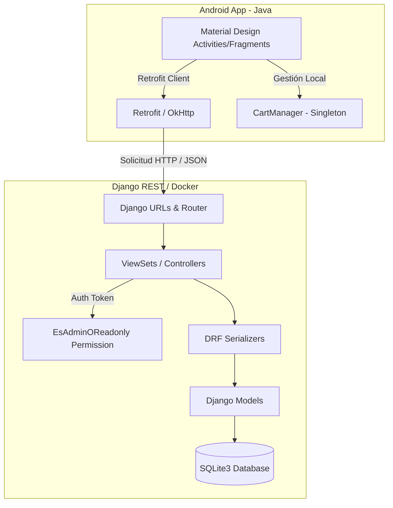

<p align="center">
  
</p>

# Essence - Proyecto Final Tienda de Perfumes

Una plataforma **Full Stack** completa para la gestión y compra de perfumes premium. Este proyecto se compone de un robusto **Backend API REST** desarrollado con **Django** y **Django REST Framework** y una aplicación **Frontend Móvil Nativa** desarrollada en **Android (Java)**.

---

## 📐 Arquitectura General del Sistema

El sistema implementa una arquitectura desacoplada basada en cliente-servidor:
- **Servidor (Backend):** Proporciona servicios REST a través de endpoints JSON. Se encarga de la lógica de negocio, validaciones, persistencia relacional en base de datos y control de accesos mediante roles (`admin` y `usuario`). Puede correr en local o encapsulado en contenedores Docker.
- **Cliente (Frontend):** Una aplicación móvil nativa diseñada bajo principios de **Material Design**. Se conecta a la API utilizando **Retrofit**, gestiona el estado local del carrito mediante un patrón Singleton (`CartManager`) y ofrece una interfaz fluida e intuitiva con efectos visuales modernos.



---

## ✨ Características Principales

### 🖥️ Backend API (Django REST & Docker)
* **Autenticación Basada en Tokens:** Registro e inicio de sesión seguro utilizando `TokenAuthentication` nativo de Django REST Framework.
* **Catálogo Completo:** Gestión relacional de Perfumes, Categorías (ej. Amaderado, Floral) y Notas Aromáticas (ej. Ámbar, Vainilla).
* **Control de Accesos (Roles):** Sistema híbrido de permisos (`EsAdminOReadonly`) donde cualquier usuario puede navegar e investigar los perfumes, pero solo los usuarios con rol de `admin` pueden crear, actualizar o borrar elementos del catálogo.
* **Algoritmo de Popularidad en Tiempo Real:** Endpoint estadístico que calcula al vuelo el Top 5 de perfumes más marcados como favoritos por la comunidad (`/perfumes/populares/`).
* **Historial y Pedidos:** Gestión robusta de transacciones a través de modelos de `Compra` y `LineaPedido`.
* **Despliegue con Docker:** Totalmente automatizado mediante contenedores para facilitar un inicio inmediato sin instalar dependencias de Python localmente.

### 📱 Aplicación Móvil (Android Java)
* **Pantalla de Inicio Dinámica (HomeFragment):**
  * Buscador interactivo en tiempo real.
  * Carrusel destacado con el Top 5 de perfumes más populares del backend.
  * Listado completo del catálogo en una rejilla interactiva.
* **Descubrimiento e Categorización:**
  * Navegación organizada por **Categorías** y **Notas Aromáticas**.
  * Pantallas de filtrado dedicadas que listan perfumes específicos según su nota o categoría elegida.
* **Detalle Premium del Producto (PerfumeDetailActivity):**
  * Ficha de especificaciones detallada (Marca, Tipo, Género, Precio, Notas).
  * Carga asíncrona de imágenes optimizada mediante **Glide**.
  * Sincronización instantánea de Favoritos (icono de corazón animado).
* **Gestión del Carrito de Compras Local:**
  * Adición dinámica de productos desde el detalle.
  * **Eliminación Premium integrada:** Botón de papelera con tintado inteligente (`#FFE53935`) y animación de pulsación (*ripple*) que permite eliminar un producto completo del carrito instantáneamente.
  * Recálculo en tiempo real del importe de compra y actualización inmediata de la interfaz.
* **Pasarela de Pago y Pedidos:**
  * Simulación de pasarela de pago interactiva con un cargador visual de estado (`ProgressDialog`).
  * Registro transaccional seguro y secuencial de la Compra y sus correspondientes Líneas de Pedido en la API remota.
  * Limpieza automática del carrito local al finalizar con éxito.
* **Historial de Compras (`PurchaseHistoryActivity`):**
  * Listado histórico que permite al usuario revisar todas sus compras pasadas directamente desde su perfil móvil.
* **Funciones Administrativas Internas:**
  * Formularios embebidos en el frontend para que los administradores autorizados puedan añadir o modificar perfumes directamente desde el teléfono móvil.

---

## 🛠️ Tecnologías y Dependencias

### Backend (API REST)
* **Python 3.x**
* **Django 5.x** (Framework web principal)
* **Django REST Framework (DRF)** (Creación del servicio API RESTful)
* **SQLite3** (Motor de base de datos relacional)
* **Docker & Docker Compose** (Virtualización y despliegue rápido)

### Frontend (Android App)
* **Java 8 (JDK 17)**
* **Android Gradle Plugin / Kotlin DSL**
* **Retrofit 2 & OkHttp** (Gestión de peticiones de red y deserialización JSON)
* **Glide 4** (Biblioteca de carga y caché de imágenes asíncrona)
* **Material Design Components** (Componentes de interfaz estilizados y modernos)

---

## 🐳 Docker y Contenedores

El backend del sistema está completamente dockerizado para garantizar la máxima portabilidad y facilitar un despliegue inmediato. La configuración consta de dos piezas clave:

### 1. [Dockerfile (de la API)](file:///c:/Users/curra/Downloads/proyectofinal/backend/Dockerfile)
Utiliza una imagen de Python oficial ligera y segura (`python:3.11-slim`) y realiza de forma automatizada las siguientes acciones en su punto de entrada (`CMD`):
* **Migraciones automáticas:** Corre `python manage.py migrate` al arrancar.
* **Autopoblado de datos condicional:** Verifica si la base de datos de perfumes tiene 0 elementos. Si está vacía, ejecuta el script `poblar_perfumes.py` para rellenar de forma inmediata el catálogo (categorías, notas y perfumes de muestra). Si ya contiene datos, omite este paso de manera segura.
* **Servidor en vivo:** Inicia el servidor de desarrollo en la interfaz `0.0.0.0:8000`.

### 2. [docker-compose.yml (en la raíz)](file:///c:/Users/curra/Downloads/proyectofinal/docker-compose.yml)
Orquesta el contenedor de la API y expone las siguientes facilidades de desarrollo:
* **Mapeo de Puertos:** Enlaza el puerto `8000` de tu máquina host con el puerto `8000` del contenedor.
* **Volúmenes en Tiempo Real:** Sincroniza la carpeta `./backend` local con `/app` dentro del contenedor para soportar *hot-reload* (recarga en vivo del servidor en cada guardado de código en tu editor favorito).
* **Variables de Entorno:** Configura `PYTHONUNBUFFERED=1` para asegurar que los logs de consola de Django se visualicen en tiempo real sin almacenamiento intermedio.

### Comando de Despliegue en 1 Paso
Para levantar todo el ecosistema del servidor (base de datos, migraciones, población de datos y API) mediante Docker, simplemente ejecuta desde la raíz del proyecto:
```bash
docker-compose up --build
```
Una vez levantado, la API completa estará accesible en `http://localhost:8000/`.

---

## 📂 Estructura del Directorio del Proyecto

```text
proyectofinal/
├── backend/                         # CÓDIGO DEL SERVIDOR DJANGO
│   ├── backend/                     # Configuración principal del proyecto Django
│   │   ├── settings.py
│   │   ├── urls.py
│   │   └── wsgi.py
│   ├── tienda/                      # Aplicación principal de la tienda de perfumes
│   │   ├── admin.py                 # Panel de administración Django
│   │   ├── models.py                # Modelos de base de datos (Usuario, Perfume, Compra...)
│   │   ├── serializers.py           # Serializadores de DRF (Validación y formateo JSON)
│   │   ├── urls.py                  # Enrutamiento de la app tienda
│   │   └── views.py                 # Lógica de las vistas de API y ViewSets
│   ├── poblar_perfumes.py           # Script autónomo para poblar el catálogo inicial
│   ├── db.sqlite3                   # Base de datos SQLite
│   ├── Dockerfile                   # Dockerfile para la construcción del contenedor de la API
│   └── manage.py
│
├── frontend/                        # CÓDIGO DE LA APLICACIÓN ANDROID (JAVA)
│   ├── app/
│   │   ├── src/main/
│   │   │   ├── java/com/example/proyectofinal/
│   │   │   │   ├── MainActivity.java
│   │   │   │   ├── data/
│   │   │   │   │   ├── api/
│   │   │   │   │   │   ├── ApiService.java        # Declaración de endpoints Retrofit
│   │   │   │   │   │   └── RetrofitClient.java    # Configuración de base URL e interceptores
│   │   │   │   │   ├── local/
│   │   │   │   │   │   ├── CartItem.java          # Estructura del elemento del carrito
│   │   │   │   │   │   └── CartManager.java       # Singleton de gestión del carrito
│   │   │   │   │   └── model/                     # Modelos de datos del frontend (Perfume, Usuario...)
│   │   │   │   └── ui/
│   │   │   │       ├── PerfumeDetailActivity.java # Ficha técnica de perfume
│   │   │   │       ├── adapter/                   # Adaptadores de RecyclerView (Cart, Perfumes, Categories...)
│   │   │   │       ├── categories/                # Vistas y lógica de categorías
│   │   │   │       ├── home/                      # Panel principal, carrusel y catálogo
│   │   │   │       ├── login/                     # Panel de Splash, Inicio de sesión y Registro
│   │   │   │       ├── notes/                     # Vistas y lógica de notas aromáticas
│   │   │   │       └── profile/                   # Carrito de compras, favoritos e historial
│   │   │   └── res/
│   │   │       ├── drawable/                      # Recursos vectoriales e iconos (ic_delete, ic_home...)
│   │   │       ├── layout/                        # Diseños XML de pantallas y celdas
│   │   │       └── values/                        # Estilos, temas y definición de colores premium
│   └── build.gradle.kts
├── docker-compose.yml               # Archivo de orquestación de Docker
└── logo.png                         # Logo oficial de Essence
```

---

## 📋 Documentación de la API (Endpoints)

Todas las respuestas y peticiones están en formato **JSON**. Las rutas que indican `(Token)` requieren la cabecera `Authorization: Token <tu_token>` en la solicitud HTTP.

| Recurso | Método | Endpoint | Descripción | Requiere Token |
| :--- | :---: | :--- | :--- | :---: |
| **Sesión** | `POST` | `/iniciar-sesion/` | Inicia sesión y retorna Token, ID y rol. | No |
| **Usuarios** | `POST` | `/usuarios/` | Registra un nuevo usuario en la plataforma. | No |
| **Usuarios** | `GET` | `/usuarios/{id}/favoritos/` | Obtiene el catálogo de favoritos del usuario. | Sí |
| **Usuarios** | `POST` | `/usuarios/{id}/favoritos/{perfume_id}/` | Añade un perfume a favoritos del usuario. | Sí |
| **Usuarios** | `DELETE` | `/usuarios/{id}/favoritos/{perfume_id}/` | Elimina un perfume de favoritos del usuario. | Sí |
| **Usuarios** | `GET` | `/usuarios/{id}/compras/` | Obtiene el historial de compras del usuario. | Sí |
| **Perfumes** | `GET` | `/perfumes/` | Retorna el listado completo de perfumes. | No |
| **Perfumes** | `GET` | `/perfumes/{id}/` | Retorna el detalle de un perfume en específico. | No |
| **Perfumes** | `POST` | `/perfumes/` | Añade un nuevo perfume al catálogo (Admin). | Sí |
| **Perfumes** | `PUT` | `/perfumes/{id}/` | Modifica un perfume existente (Admin). | Sí |
| **Perfumes** | `DELETE` | `/perfumes/{id}/` | Elimina un perfume del catálogo (Admin). | Sí |
| **Perfumes** | `GET` | `/perfumes/populares/` | Top 5 perfumes más añadidos a favoritos. | No |
| **Categorías** | `GET` | `/categorias/` | Obtiene todas las categorías. | No |
| **Categorías** | `GET` | `/categorias/{id}/perfumes/` | Lista perfumes pertenecientes a esa categoría. | No |
| **Notas** | `GET` | `/notas/` | Obtiene el listado de notas aromáticas. | No |
| **Notas** | `GET` | `/notas/{id}/perfumes/` | Lista perfumes que incorporan esa nota aromática. | No |
| **Compras** | `POST` | `/compras/` | Registra una nueva transacción de compra. | Sí |
| **Líneas** | `POST` | `/lineas_pedido/` | Vincula un producto, cantidad y precio a la compra. | Sí |

---

## 🚀 Guía de Instalación y Ejecución sin Docker

Si prefieres levantar el servidor manualmente paso a paso, sigue estas instrucciones:

1. **Ingresar a la carpeta de backend:**
   ```bash
   cd backend
   ```

2. **Crear y activar un entorno virtual (venv):**
   ```bash
   # En Windows:
   python -m venv venv
   .\venv\Scripts\activate

   # En macOS/Linux:
   python3 -m venv venv
   source venv/bin/activate
   ```

3. **Instalar dependencias necesarias:**
   ```bash
   pip install django djangorestframework django-cors-headers pillow
   ```

4. **Aplicar migraciones y popular la base de datos:**
   ```bash
   python manage.py makemigrations
   python manage.py migrate
   python poblar_perfumes.py
   ```

5. **Lanzar el servidor:**
   ```bash
   python manage.py runserver 0.0.0.0:8000
   ```

---

## 📱 Inicialización del Frontend (Android App)

1. Abre **Android Studio** y selecciona **Open An Existing Project**.
2. Dirígete a la carpeta `proyectofinal/frontend` y ábrela. Deja que Gradle descargue todas las dependencias y sincronice el proyecto por primera vez.
3. **Configuración de la Base URL:**
   Por defecto, el archivo [RetrofitClient.java](file:///c:/Users/curra/Downloads/proyectofinal/frontend/app/src/main/java/com/example/proyectofinal/data/api/RetrofitClient.java) está configurado con la IP `http://10.0.2.2:8000/` (la IP por defecto que utiliza el Emulador de Android para redireccionar de forma transparente al `localhost` de tu ordenador principal).
   * *Nota:* Si ejecutas la aplicación en un **dispositivo Android físico**, asegúrate de que tanto tu ordenador como el teléfono están conectados a la misma red Wi-Fi y modifica la constante `BASE_URL` en [RetrofitClient.java](file:///c:/Users/curra/Downloads/proyectofinal/frontend/app/src/main/java/com/example/proyectofinal/data/api/RetrofitClient.java) con la dirección IP local de tu ordenador (ej. `http://192.168.1.50:8000/`).
4. Haz clic en **Run 'app'** (`Shift + F10`) en Android Studio para compilar y desplegar la app en tu emulador o terminal.

---

## 👤 Cuenta de Prueba Recomendada

Para explorar rápidamente todas las capacidades (incluyendo las capacidades de Administrador), puedes iniciar sesión con las siguientes credenciales una vez poblada la base de datos:

* **Usuario Administrador (Admin):**
  * **Usuario:** `admin`
  * **Contraseña:** `admin123`
* **Usuario Común (Cliente):**
  * **Usuario:** `cliente1`
  * **Contraseña:** `cliente123`
